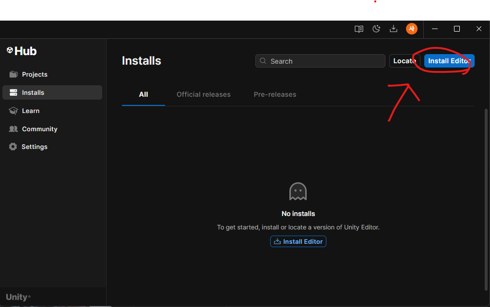

# Unity
2025-Unity
## 유니티

### 유니티 다운로드
- 유니티 공식홈페이지
    1. https://unity.com/kr
    2. 
    - 여기 들어가서 다운 ㄱㄱ
    3. 
    - Personal 다운로드
    - 회원가입 
    4. 
    - 필요한거만 다운 아니면 오래걸림 스킵 (대충 1시간 이상걸림)
    5. 
    - 여기 눌러서 
    6. 
    - 맨위에 보다 LTS 인스톨(2년정도 보장한다)
    7. 
    - 조금 내리면 윈도우랑 한국어 체크후 Contlnue 
    8. 

### 유니티 기초 
- 유니티 허브에서 New project 생성
    - UI배치는 자신이 편리한 곳에다가 끌어다 놓기
- 기본적인 도구
    - Scene : 표현할 공간

### 유니티의 생명주기 
1. 초기화
- 오브젝트의 흐름
    - Awake() : 오브젝트 생성할 때, 최초로 실행 (딱한번만 실행됨)
        ```csharp
        void Awake()
        {
            Debug.Log("플레이어 데이터가 준비되었습니다");
        }
        ```
    - Start() : 업데이트 시작 직전 최초로 실행 (딱한번만 실행됨)
        ```csharp
        void Start()
        {
            Debug.Log("플레이어가 사냥직전 장비를 챙겼습니다");
        }
        ```

2. 물리 
    - FixedUpdate() : 물리 연산 업데이트 고정된 실행 주기로 CPU를 많이 사용함
        ```csharp
        void FixedUpdate()
        {
            Debug.Log("이동~"); // 1초에 50번정도 실행됨
        }
        ```
3. 게임로직
    - Update() : 물리연산을 제외한 나머지 로직
        ```csharp
        void Update()
        {
            Debug.Log("몬스터 사냥!!");
        }
        ```
    - LateUpdate() : 모든 업데이트 끝난 후 
        ```csharp
        void LateUpdate()
        {
            Debug.Log("경험치 획득.");
        }
        ```
4. 해체
    - OnDestroy() : 오브젝트가 삭제될때
        ```csharp
        void OnDestroy()
        {
            Debug.Log("플레이어 데이터를 해체하였습니다.");
        }
        ```

5. 활성화
    - OnEnable() : 게임 오브젝트가 활성화 되었을때 실행
        1. 활성화는 `초기화`와 `물리`사이에서 작용한다
        2. 최초 1회가 아닌 켜고 끄고가 가능
    
    ```csharp
    void OnEnable()
    {
        Debug.Log("플레이어 로그인");
    }
    ```
6. 비활성화
    - OnDisable() : 게임 오브젝트가 비활석화 되었을 때 실행
        1. `게임로직`과 `해체` 사이에서 작용한다 
        2. 최초 1회가 아닌 켜고 끄고가 가능
    ```csharp
    void OnDisable()
    {
        Debug.Log("플레이어 로그아웃");
    }
    ```

## 동작
- 동작을 움직이게하려면 Update()에다가 해야한다 
- 키 입력같은 것도 Update에다가 한다 
